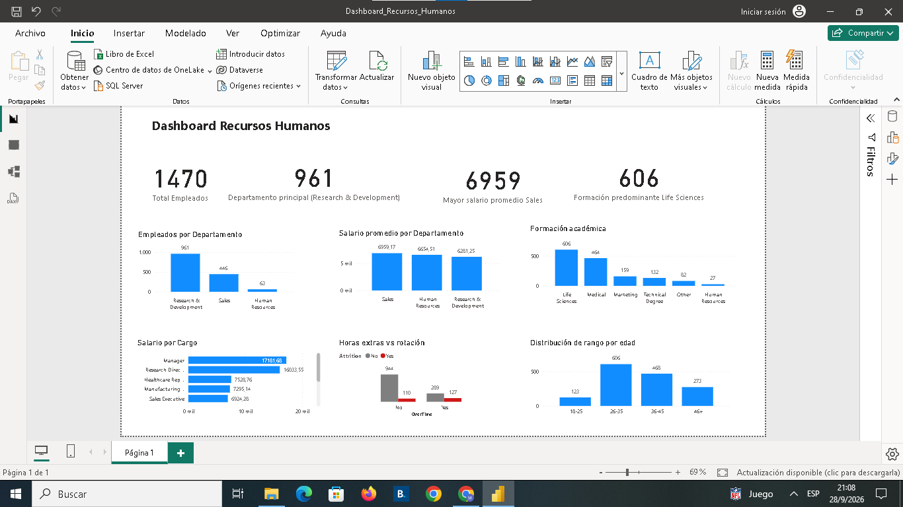

# Dashboard de Recursos Humanos

Proyecto de análisis de datos de Recursos Humanos desarrollado a partir de una base de empleados. El proyecto integra **SQL Server, Excel y Power BI** para explorar los datos, obtener indicadores y construir dashboards orientados al análisis de personal.

## Objetivo

Analizar la información de los empleados para identificar patrones y características relevantes de la organización, principalmente en relación con:

- Distribución del personal por departamento.
- Salarios y salarios promedio.
- Cargos y niveles salariales.
- Formación académica.
- Horas extras y rotación.
- Distribución de empleados por rango de edad.

## Herramientas utilizadas

- **SQL Server:** exploración y análisis de los datos mediante consultas SQL.
- **Microsoft Excel:** construcción de un dashboard con indicadores y gráficos.
- **Power BI:** desarrollo de un dashboard interactivo para visualizar los principales resultados.
- **GitHub:** documentación y publicación del proyecto.

## Análisis SQL

Las consultas SQL se utilizaron como etapa inicial del análisis, permitiendo explorar la información de empleados antes de construir las visualizaciones.

### Consulta principal

La consulta utilizada para visualizar la tabla de empleados es:

```sql
SELECT *
FROM Empleados;
```


Esta consulta permite obtener la información completa de la tabla de empleados y utilizarla como punto de partida para los análisis posteriores.

### Principales análisis realizados

- Cantidad de empleados por departamento.
- Salario promedio por departamento.
- Distribución de empleados según formación académica.
- Salario por cargo.
- Relación entre horas extras y rotación.
- Distribución de empleados por rango de edad.

## KPIs principales

El dashboard presenta los siguientes indicadores:

| Indicador | Resultado |
|---|---:|
| Total de empleados | **1.470** |
| Departamento con mayor cantidad de empleados | **Research & Development** |
| Empleados del departamento principal | **961** |
| Departamento con mayor salario promedio | **Sales** |
| Mayor salario promedio por departamento | **$6.959** |
| Formación académica predominante | **Life Sciences** |
| Empleados con formación predominante | **606** |

## Dashboards

El proyecto cuenta con dos versiones del dashboard: **Excel** y **Power BI**.

### Excel

El dashboard de Excel reúne los principales indicadores y visualizaciones del análisis en una única vista.

Incluye:

- Total de empleados.
- Departamento principal.
- Mayor salario promedio por departamento.
- Formación académica predominante.
- Empleados por departamento.
- Salario promedio por departamento.
- Formación académica.
- Salario por cargo.
- Horas extras vs. rotación.
- Distribución por rango de edad.


### Power BI

La versión en Power BI presenta los mismos análisis mediante visualizaciones interactivas, facilitando la exploración de los datos y la comparación entre diferentes dimensiones de Recursos Humanos.



## Visualizaciones

### Empleados por departamento

Compara la cantidad de empleados por departamento. Research & Development es el departamento con mayor cantidad de empleados.

```sql
Select Department,
       COUNT(*) AS Cantidad_Empleados
From Empleados
GROUP BY Department
ORDER BY Cantidad_Empleados DESC;


```


### Salario promedio por departamento

Compara el salario promedio entre los departamentos. **Sales** presenta el mayor salario promedio, con aproximadamente **$6.959**.

```sql
SELECT Department,
       AVG(MonthlyIncome) AS Salario_Promedio
FROM Empleados
GROUP BY Department
ORDER BY Salario_Promedio DESC;
```


### Formación académica

Muestra la cantidad de empleados según su campo de formación. **Life Sciences** es la formación predominante, con **606 empleados**.

```sql
SELECT EducationField,
       COUNT(*) AS Cantidad_Empleados
FROM Empleados
GROUP BY EducationField
ORDER BY Cantidad_Empleados DESC;
```


### Horas extras vs. rotación

Compara la realización de horas extras con la rotación de los empleados, permitiendo analizar diferencias en la distribución de empleados según ambas variables.

```sql
SELECT OverTime,
       Attrition,
       COUNT(*) AS Cantidad_Empleados
FROM Empleados
GROUP BY OverTime, Attrition
ORDER BY OverTime, Attrition;
```


### Salario por cargo

Compara el salario promedio de los diferentes cargos de la organización mediante un gráfico de barras.

```sql
SELECT JobRole,
       AVG(MonthlyIncome) AS Salario_Promedio,
       COUNT(*) AS Cantidad_Empleados
FROM Empleados
GROUP BY JobRole
ORDER BY Salario_Promedio DESC;
```


### Distribución por rango de edad

Muestra la cantidad de empleados según los diferentes rangos de edad definidos para el análisis.

```sql
SELECT
    CASE
        WHEN Age BETWEEN 18 AND 25 THEN '18-25'
        WHEN Age BETWEEN 26 AND 35 THEN '26-35'
        WHEN Age BETWEEN 36 AND 45 THEN '36-45'
        ELSE '46+'
    END AS Rango_Edad,
    COUNT(*) AS Cantidad
FROM Empleados
GROUP BY
    CASE
        WHEN Age BETWEEN 18 AND 25 THEN '18-25'
        WHEN Age BETWEEN 26 AND 35 THEN '26-35'
        WHEN Age BETWEEN 36 AND 45 THEN '36-45'
        ELSE '46+'
    END
ORDER BY Rango_Edad;
```


## Conclusión general

La dotación de empleados está concentrada principalmente en **Research & Development**, que reúne **961 de los 1.470 empleados**. En cuanto a formación académica, **Life Sciences y Medical** son los campos más frecuentes, con **606 y 464 empleados**, respectivamente. **Sales** presenta el mayor salario promedio entre los departamentos, con aproximadamente **$6.959 mensuales**. La distribución etaria muestra una mayor concentración de empleados entre los **26 y 45 años**.


## Estructura del proyecto

El proyecto reúne el proceso completo de análisis de datos:

**SQL Server → Exploración y consultas → Excel / Power BI → Visualización → Conclusiones**

## Autor

**Mariano Zamora**

Proyecto desarrollado como parte de mi portfolio de **análisis de datos**.
